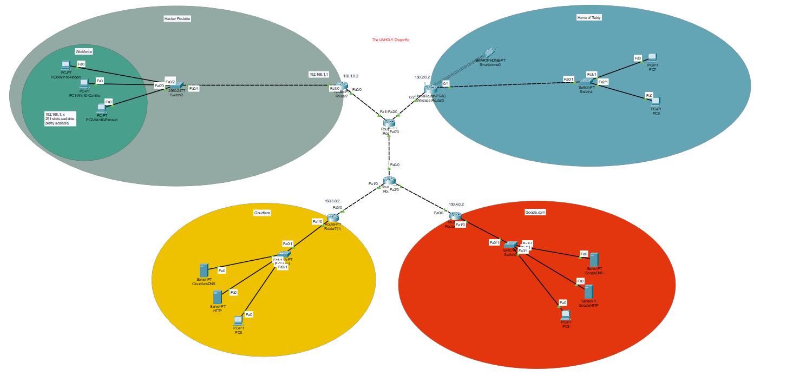
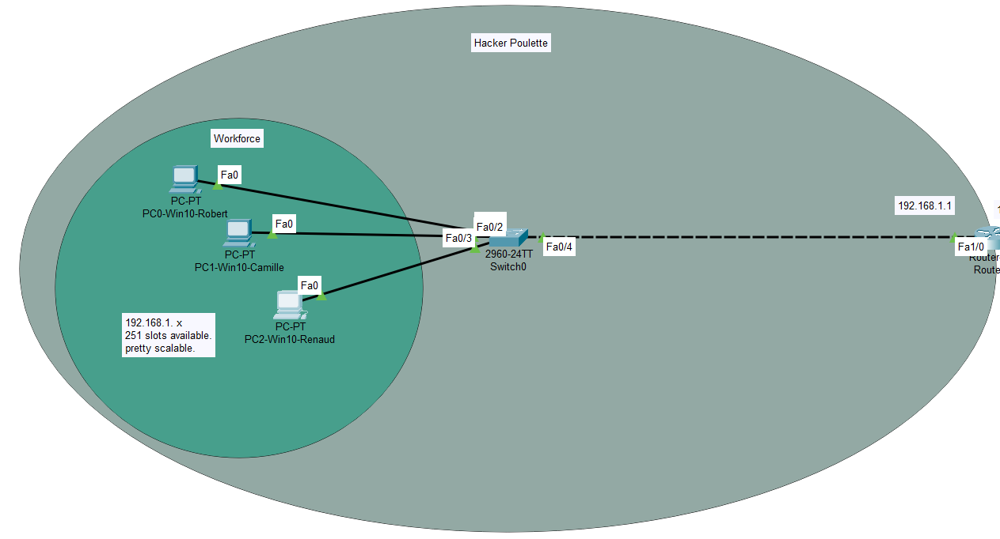
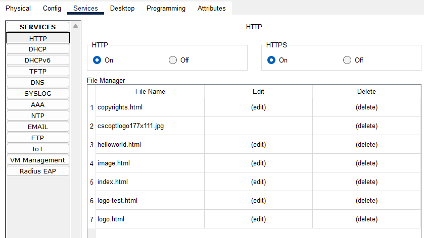
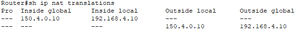

# SmallNetwork
***A simple network design made with cisco packet tracer***

Behold....

## THE UNHOLY DRAGONFLY

This is my first network. to see the assignment, feel free to look here :
[assignment](./Assets/Build_simple_network.md)

It includes :  
* Setting up the hardware
* Setting up the hosts parameters
* Setting up the servers parameters (*Bonus*)
* Setting up the routers parameters
* Adding a NAT (*Bonus*)

### 1 - Hardware

As we know, we will need :
* 3 PC's
* A switch ( take the good one in the list)
* A router

But we will need to think our wiring before doing it, as it will be easier for us to setup if we're being consistent in our namings.
So you select cross-cables for Router-Switch, then user normal copper wires to bind the switch to the hosts.

### 2 - Setting up the hosts

Before going into the setups, we need to think about the global addressing of our network. I chose to use 192.168.1.0/24 as my range, and I'm reserving the ten firsts slots.

So I go into the pc's configurations and give them :

* a Gateway ( which is the first one, as in the convention) : 192.168.1.1
* a local IP address to the lan card : 192.168.1.10 (PC0, 11 for PC1, 12 for PC2)

### 3 - Inserting good switch

nothing to setup. really, just throw it in there. it's gonna populate the arp tables itself, like a grown boy.

### 4 - Adding router and configuring it

This is where the fun comes. Just Configure it to give the gateway to the lan card. so in my case 192.168.1.1. the hosts will recognize it as the gateway. depending from what you have on the other side of the internet, you have to configure the other lan card with the same IP range,

I'm setting up a public IP address for later, and I chose 150.0.0.0, So I give 150.1.0.2. It will later try to reach 150.1.0.1 which is the next hop.
now you just need to put a static route to say that if it wants something, to go to 150.1.0.1

In my case, I'm giving the route 

---

>*Raport*  
>*Router>enable*  
>*Router#*  
>*Router#configure terminal*   
>*Router(config)#interface FastEthernet0/0*   
>*Router(config-if)#ip address 150.1.0.2 255.255.0.0*   
>*Router(config-if)#*   
>*Router(config-if)#exit*   
>*Router(config)#interface FastEthernet1/0*   
>*Router(config-if)#ip address 192.168.1.1 255.255.255.0*   
>*Router(config-if)#*   
>*Router(config-if)#exit*   
>*Router(config)#*   
>*Router(config)#ip route 150.0.0.0 255.0.0.0 150.1.0.1*   

---

## Adding the servers

As you can see in the assignment, I'm supposed to "*Connect to the internet*" but hey, what does that mean ? I don't have any idea. I don't see internet. I create internet.

I'll add : 

* A home network
* A Cloudflare network with a HTTP server and a DNS server
* A google network with a HTTP server and a DNS server

how to : same as above for net, but setup DNS and give dns to all hosts. after that, set list of names and ip in dns service. 

after, setting up http server and putting your html in the files. that's it.

just adding dns ip in your host's dns,
And now you can browse from your host !

## Setting up the NAT

Network Address Translation (NAT) plays a pivotal role in network environments by concealing internal IP addresses, bolstering security against external threats. It facilitates seamless communication between private networks and the internet, crucial for safeguarding sensitive data and resources. Moreover, NAT optimizes the utilization of available IP addresses, a necessity in the face of IPv4 address depletion, ensuring sustainable network growth and functionality.

From a router's perspective, Network Address Translation (NAT) works by intercepting outgoing packets from devices within a local network. It then replaces the private IP addresses of these devices with the router's public IP address before forwarding them to the internet. When responses return, the router utilizes its NAT table to determine which internal device to route the traffic to based on port numbers. This process allows multiple devices within the local network to share a single public IP address, enabling secure and efficient communication with external networks.

It has a table where it can remap incoming packets.

---

>*Rapport*   
>*Router(config)# Ip nat inside source static 192.168.1.10 150.1.0.10*   
>*Router(config)# Ip nat outside source static 192.168.1.10 150.1.0.10*   
>*Router# show ip nat translations*   

